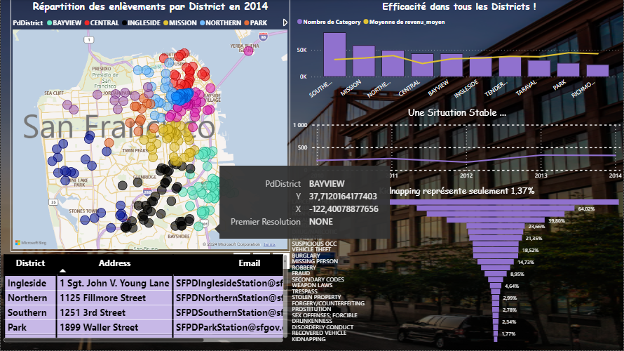
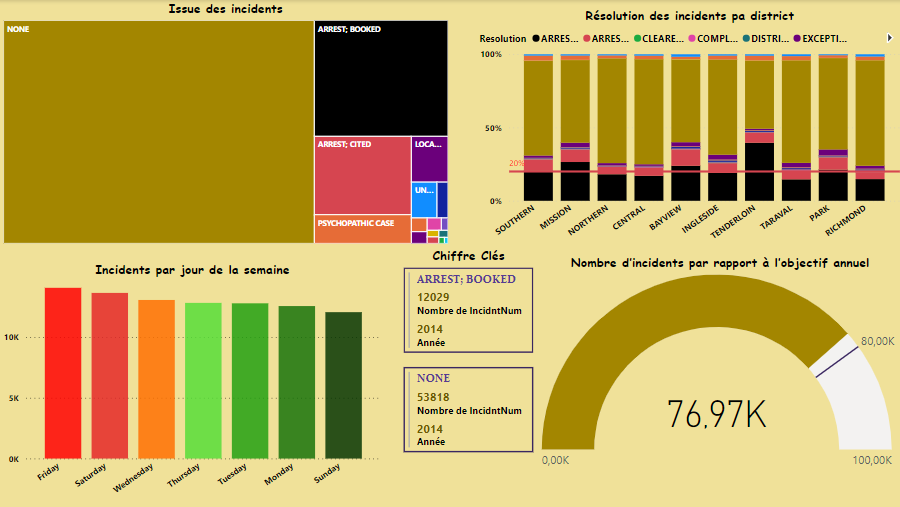

<ul >
    <li>ELGHAZI Soufiane</li>
</ul>

 

<h1 style='color:#4c4893' align='center'>
    Projet - POWER BI
</h1>
<h2 style='color:purple' align='center'>
La manipulation de données et de la réalisation de 
tableau de bord avec Power BI
</h2>

Dans ce projet nous allons effectuer de la manipulation de données et de la réalisation de tableau de bord. Le jeu de données qui sera utilisé concerne les incidents recensés par le San Francisco Police Département. Ce jeu de données comprend la catégorie d’incidents, la date et le lieu de celui-ci et sa résolution. La source de données est disponible dans le lien ci-dessous:  <a href="https://data.sfgov.org/Public-Safety/Police-Department-Incident-Reports-Historical-2003/tmnf-yvry" style="color:orangered;">Lien vers la source de données </a>

 

Dans ce Répértoir vous allez trouver les éléments suivants:
<ul>
    <li>Projet-PowerBI :Fichier qui contient les consignes de projet</li>
    <li>Police-Department-Incidents.pbix:Fichier powerbi qui contient les visuels et les requêtes de transformations</li> 
</ul>

 

Voici le premier Dashboard qu'on va réalisé :

 

    

 

et  le deuxieme Dashboard:

 

    

 

 ✨ THE END ✨
 